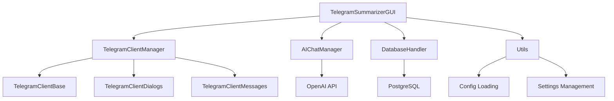

# Архитектура Sammaryhelper

## Обзор системы
Sammaryhelper - приложение для анализа и суммаризации диалогов Telegram с использованием OpenAI API. Основные функции:
- Подключение к Telegram
- Загрузка и анализ диалогов
- Генерация кратких содержаний
- Кеширование данных

## Диаграмма компонентов

## Основные модули
1. **GUI (TelegramSummarizerGUI)**
   - Tkinter-based интерфейс
   - Вкладки: Основное, Конфиг, Настройки
   - Управление всеми компонентами

2. **Telegram Client**
   - TelegramClientManager: координация работы
   - TelegramClientDialogs: работа с диалогами
   - TelegramClientMessages: работа с сообщениями

3. **AI Integration (AIChatManager)**
   - Работа с OpenAI API
   - Генерация саммари
   - Анализ участников

4. **Database (DatabaseHandler)**
   - Кеширование в PostgreSQL
   - Таблицы: dialogs, messages, topics
   - Поддержка тем (message_thread_id)

5. **Utils**
   - Загрузка конфигурации
   - Управление настройками
   - Вспомогательные функции

## Взаимодействие компонентов
1. GUI инициализирует все компоненты
2. Telegram Client загружает данные
3. Database кеширует данные
4. AI обрабатывает сообщения
5. Utils обеспечивает конфигурацию